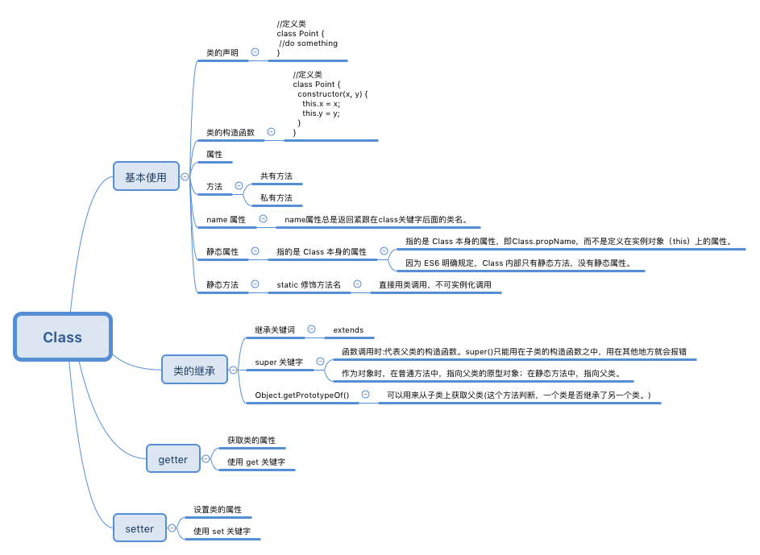

# ES6    
* ES6的学习笔记and代码练习     
* 基于webpack打包

## 很久没有看github了，没有想到很多人在看这个es6的学习分享，里面可能有很多错误，但是我现在不做前端了，很多前端知识都忘记了，如果里面有错误，恳请大家帮忙改正！祝大家早日成为优秀的前端工程师！

## let     

    

## const

## 数值的扩展    

## 数组的扩展

## 解构赋值

## 函数扩展

## 对象的扩展

## Set and Map

## Promise

## Class

